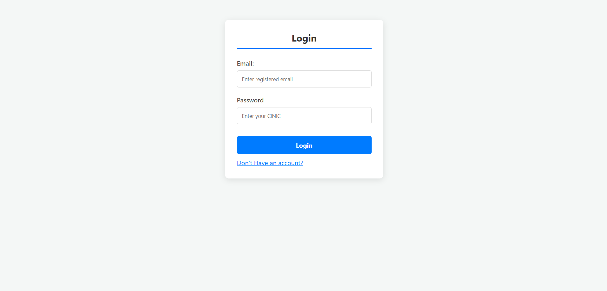
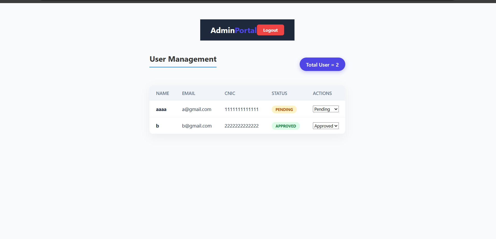
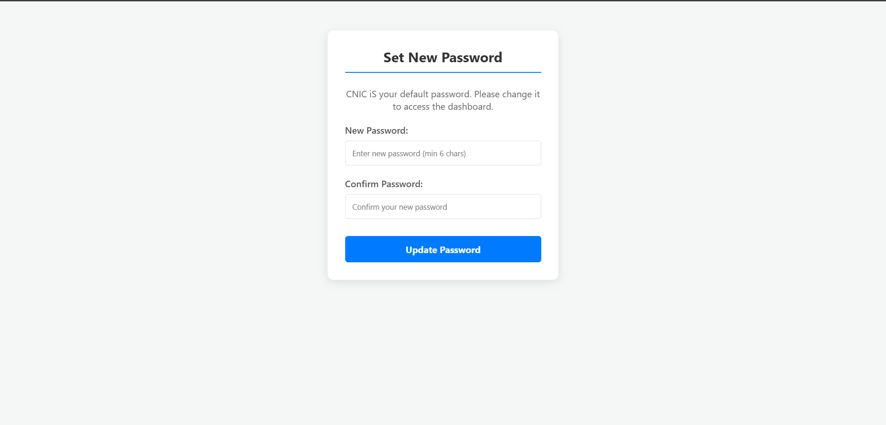
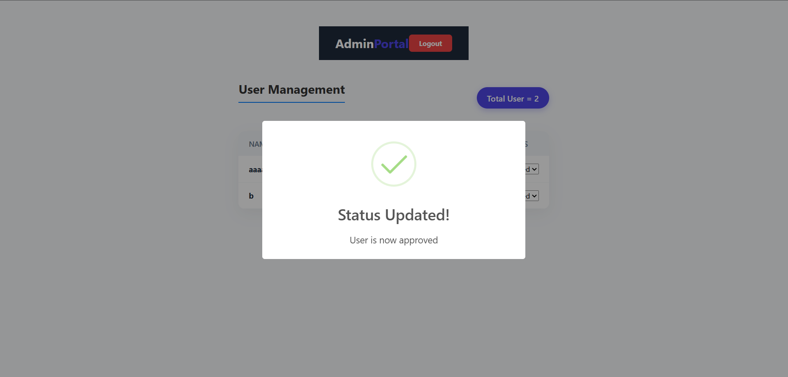

# 🛡️ Admin & User Management System (RBAC)

A sophisticated, secure, and modern **Role-Based Access Control (RBAC)** portal built with pure Vanilla JavaScript. This project demonstrates how to handle user authentication, administrative approvals, and data persistence without a backend.

---

##
[🚀 Click here to View Live Project](https://rafay-1431.github.io/admin-user-management-system/)

## ✨ Features

### 👤 User Side
* **Secure Registration:** Users can sign up with their Name, Email, CNIC, and Password.
* **Smart Status Check:** Users cannot log in until their account is **Approved** by the Admin.
* **Pending/Rejected Alerts:** Real-time feedback using SweetAlert2 if the account is not yet active.

### 🔑 Admin Side
* **Admin Dashboard:** A private area accessible only via unique Admin credentials.
* **User Management Table:** View all registered users in a clean, responsive table.
* **Dynamic Status Control:** Change user status from `Pending` to `Approved` or `Rejected` via a dropdown.
* **Auto-Sync:** Changes are instantly saved to LocalStorage and reflected in the UI.

### 🛠️ Technical Highlights
* **Pure CSS Design:** No Bootstrap. Custom Glassmorphism and modern UI elements.
* **Data Persistence:** Uses `localStorage` to keep data alive even after page refresh.
* **Security:** Route protection logic to prevent unauthorized users from accessing the Admin panel.

---

## 📸 Screenshots

### 1. Login & Signup Flow


### Admin Dashboard


### 🔐 Password Management


### 🔑 Admin Control



---

* **Frontend:** HTML5, CSS3 (Custom Properties)
* **Logic:** Vanilla JavaScript (ES6+)
* **Library:** [SweetAlert2](https://sweetalert2.github.io/)


---

## ⚙️ How to Test

1. **Clone the repo:**
   ```bash
   git clone [https://github.com/your-username/repo-name.git](https://github.com/your-username/repo-name.git)
